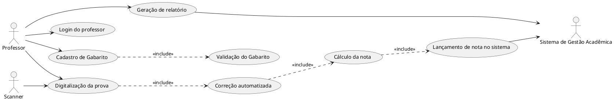
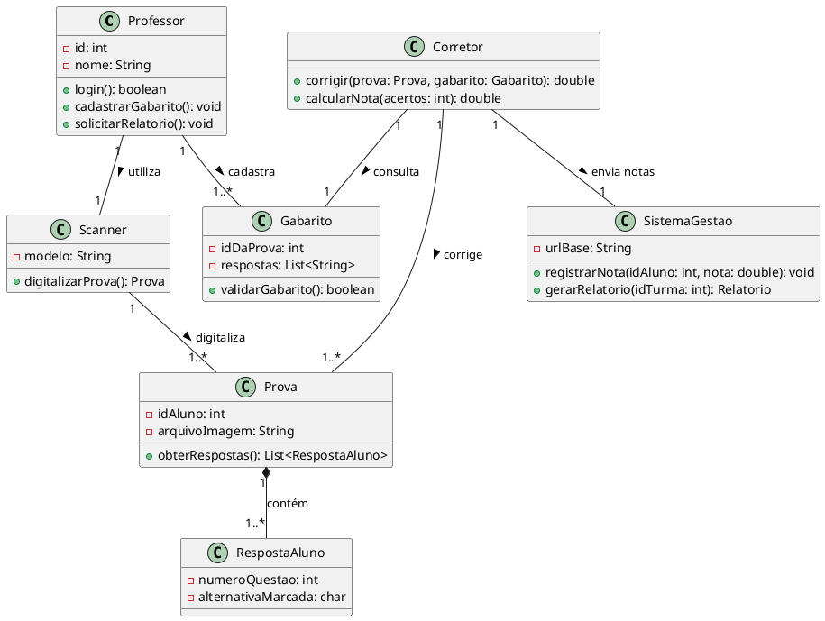
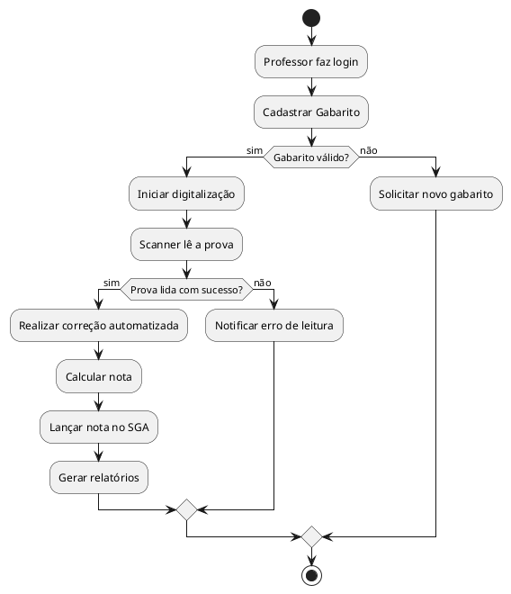
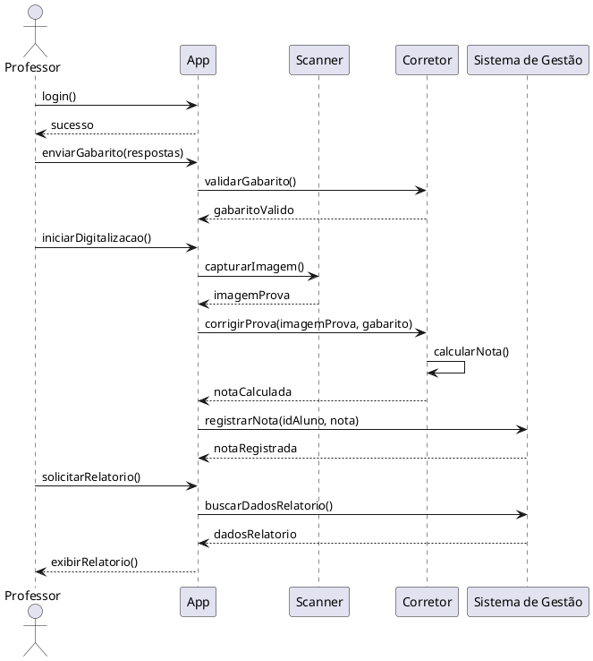

# Corretor Automático de Provas - Modelagem UML

Este documento contém a modelagem UML (Unified Modeling Language) utilizando **PlantUML** para o sistema "Corretor Automático de Provas". A proposta é simular um processo completo de correção objetiva automatizada.

## 1. Diagrama de Casos de Uso

Mapeia as principais interações dos atores (Professor, Scanner e Sistema de Gestão) com as funcionalidades do sistema.

## 2. Diagrama de Classes

Estrutura das entidades obrigatórias, seus respectivos atributos, métodos principais e os relacionamentos.

## 3. Diagrama de Atividades

Fluxo detalhado do processo completo, desde o acesso inicial até as validações lógicas e finalização.

## 4. Diagrama de Sequência

Representa a linha do tempo da execução, demonstrando a troca de mensagens entre os componentes do sistema.

---

[PDF da Atividade Preenchida](../Assets/PDFs/Corretor%20Automático%20de%20Provas%20-%20Entrega.pdf)